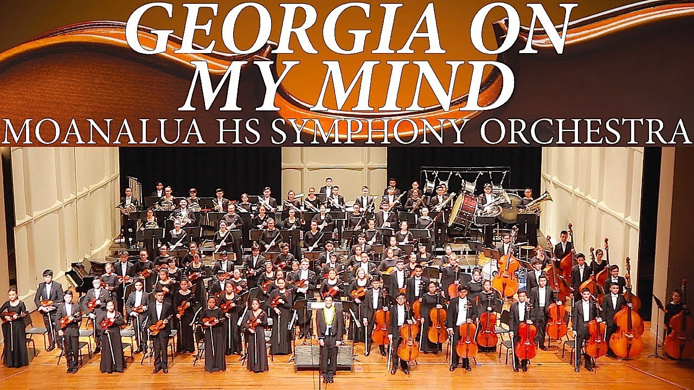

 

Orchestra has been a major part of my life in grade school and played a major role in my development as a person. As an orcchestra, we knew that we could not leave home and return without accomploshing what we have been preparing for... the performance of our lifetime.

During this time, there were many rough patches that all of us in the orchestra overcame, individually and as a whole. Our reportoire included: 
1. Overture to Morning, Noon and Night in Vienna - Franz von Suppe (1819-1895)
2. Internet Symphony "Eroica" - Tan Dun (1957 -)
3. "Nessun Dorma" from Turandot - Giacomo Puccini (1858-1924)
4. Marche Slave, Op. 31, ("Slavonic March") - Pyotr Tchaikovsky (1840-1893)
5. (Home Performance Encore) Selections from "Les Miserables" - Claude-Michel Schonberg arr. Bob Lowden
With these compositions being one of the most musically challenging pieces to perfect, there were many mistakes and corrections to be done. This school year, most of us spent more time practicing our instruments than studying, making it a very difficult, but rewarding, school year.

We have learned many things during our time in Georgia for the ASTA Convention/Competition. There were many friends and memories made, but most importantly, we have learned how to humble ourselves as we won the title of 'Grand National Champions.'
